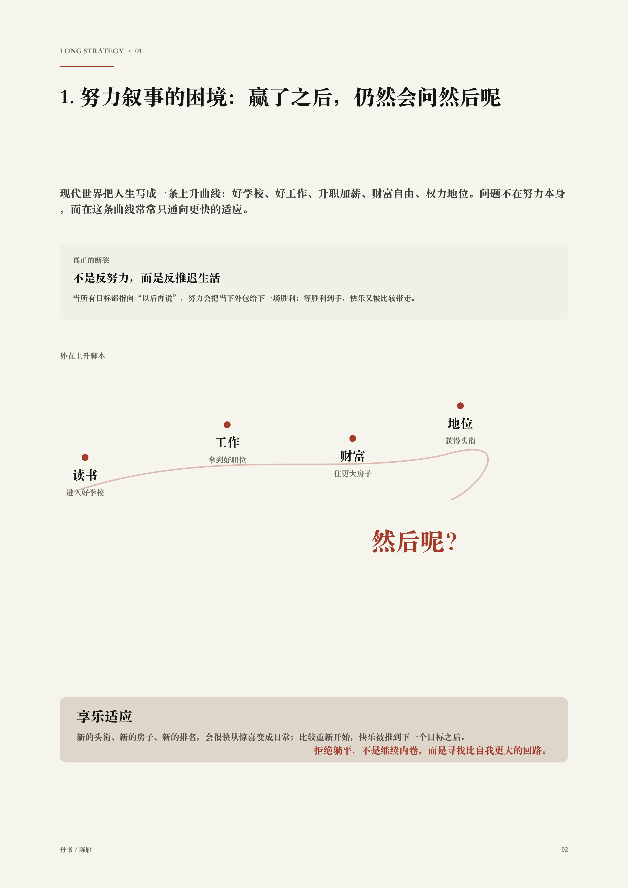
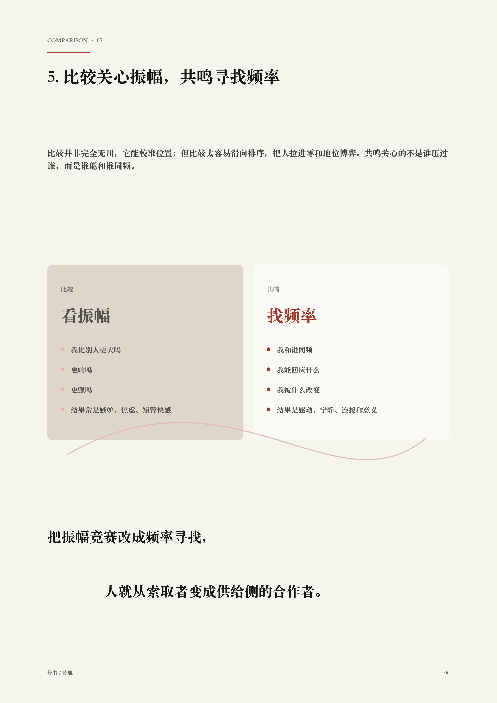
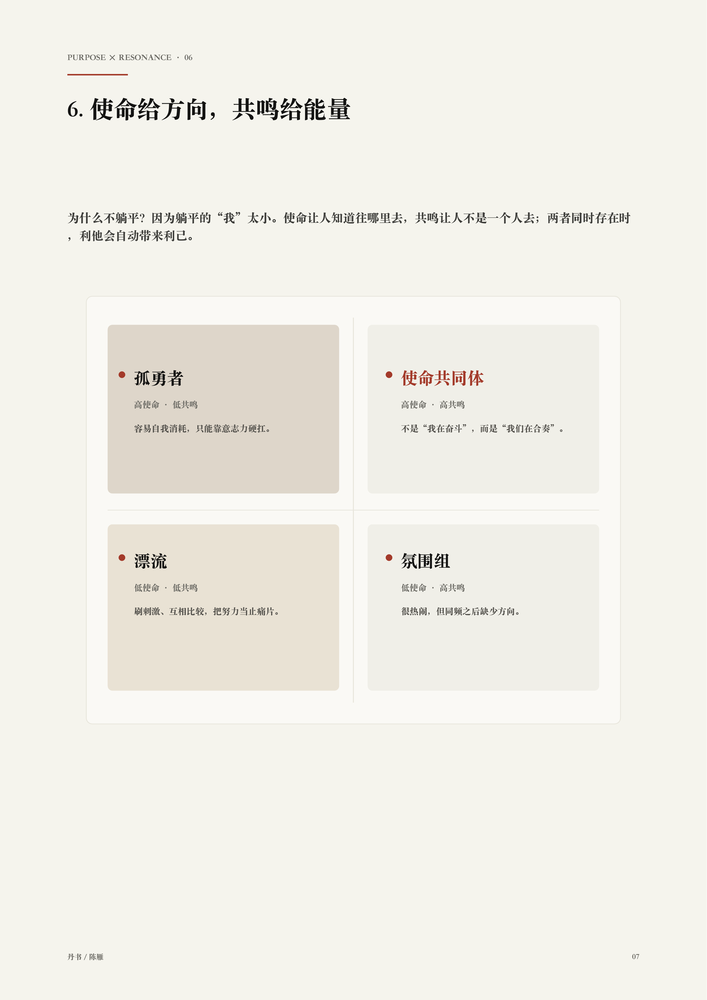
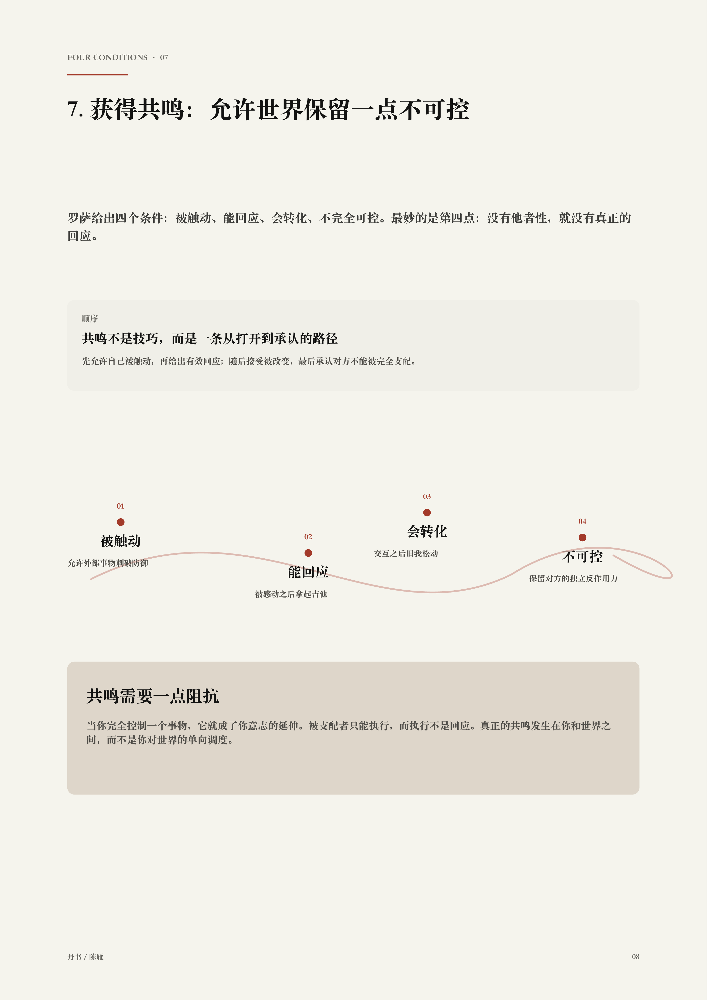

# 丹书 Danshu

**朱砂红中国风 A4 报告排版 skill。**  
**A vermilion Chinese editorial skill for A4 reports, briefs, handouts, and research notes.**

丹书把 Kami 的克制纸感，转译成更适合中文报告、讲义、调研说明和方案书的视觉语言：暖纸底、朱砂红、宋式层级、曲线图表、负面空间。

Danshu translates Kami's quiet paper texture into a Chinese editorial system: warm parchment, restrained vermilion, serif hierarchy, curved diagrams, data visualization, and deliberate negative space.

> Warm parchment. Vermilion focus. Curved judgment.  
> 暖纸为底，朱砂为睛，曲线承载判断。

## Showcase / 作品预览

<table>
  <tr>
    <td width="50%"></td>
    <td width="50%"></td>
  </tr>
  <tr>
    <td width="50%"></td>
    <td width="50%"></td>
  </tr>
</table>

## Why It Exists / 为什么做它

大多数 AI 生成的报告，要么像公司模板，要么像过度装饰的海报。丹书追求另一种气质：清醒、克制、有判断。

Most AI-generated reports look either like corporate templates or over-decorated posters. Danshu aims for a different register: calm, editorial, and judgment-first.

- 中文编辑节奏，而不是幻灯片工厂感。  
  Chinese editorial rhythm, not slide-factory gloss.
- 先有观点和数据，再谈视觉装饰。  
  Judgment and data before visual flourish.
- 曲线用来解释结构，而不是随手装饰。  
  Curves explain structure instead of merely decorating it.
- 朱砂红作为精确焦点，而不是满屏红色。  
  Vermilion is a precise focus color, never a red flood.
- PDF 与逐页高清 PNG，适合汇报、打印、微信传播。  
  PDF and page-by-page high-resolution PNG exports, ready for presentation and sharing.

## What It Makes / 它适合生成什么

- A4 纵向 PDF 小报告 / A4 portrait PDF reports
- 一页纸方案 / One-page briefs
- 调研报告与课堂讲义 / Research summaries and class handouts
- 作业说明与评分框架 / Assignment sheets and evaluation rubrics
- 合作方汇报材料 / Partner-facing proposal briefs
- 2K-4K 逐页 PNG / Page-by-page 2K-4K PNG exports

## Design Signature / 设计特征

| Role / 角色 | Token / 色值 |
| --- | --- |
| Paper / 暖纸底 | `#f5f4ed` |
| Card / 象牙卡片 | `#faf9f5` |
| Vermilion / 朱砂红焦点 | `#A33A2A` |
| Soft curve / 柔和曲线 | `#DDBBB2` |
| Text / 正文墨色 | `#141413` / `#3d3d3a` |

Typography is serif-led. Chinese documents prefer `TsangerJinKai02` when available; English falls back to Charter or Georgia. Vermilion should stay under roughly 5% of the page surface.

字体以宋式气质为主。中文优先使用 `TsangerJinKai02`，英文使用 Charter 或 Georgia。朱砂红只做视觉焦点，面积保持克制。

## Install / 安装

### TRAE / skills CLI

```bash
npx skills add xiaowuwu0620/danshu --agent trae --global --yes
```

If you only want to check whether the skill can be discovered:

```bash
npx skills add xiaowuwu0620/danshu --list
```

### Codex manual install

Copy the skill folder into your Codex skills directory:

把 skill 文件夹复制到你的 Codex skills 目录：

```bash
mkdir -p ~/.codex/skills
cp -R skill/danshu ~/.codex/skills/danshu
```

Then restart Codex.

然后重启 Codex。

## Usage / 使用方式

Ask Codex:

你可以这样对 Codex 说：

```text
Use $danshu to turn this PDF into a 3-page A4 Chinese report with curved charts and vermilion focus color.
```

```text
使用 $danshu，把这份调研材料做成 3 页 A4 纵向 PDF：朱砂红焦点色，有曲线美感，有负面空间，并导出逐页高清 PNG。
```

## Star Goal / Star 目标

目标很简单：让中文 AI 文档停止长得像默认模板。

The goal is simple: make Chinese AI documents stop looking generic.

If this saves you from another stiff AI report template, star it.  
如果它帮你躲过了一份僵硬的 AI 模板报告，欢迎点一个 star。
